<picture>
  <source media="(prefers-color-scheme: dark)" srcset="assets/hero-dark.svg">
  
</picture>

  <a href="https://iammusa.vercel.app"><b>iammusa.vercel.app</b></a>
  &nbsp;·&nbsp;
  <a href="https://www.linkedin.com/in/mmusa2/">LinkedIn</a>
  &nbsp;·&nbsp;
  <a href="mailto:mmusa2@wisc.edu">mmusa2@wisc.edu</a>
  &nbsp;·&nbsp;
  <a href="./MY-CLAUDE-SETUP.md">How I run Claude Code</a>

I'm a Master's student in Computer Science at **UW–Madison**, researching the security of large language models and agentic workflows with Dr. Somesh Jha — indirect prompt injection against RAG pipelines and tool-using agents. I'm also the founder & CEO of **Wumi Health**, where those same agentic systems build a patient-owned national health record for Pakistan.

**I study how AI systems break because I bet a company on how well they can build.**

## Now — July 2026

- **[Wumi Health](https://iammusa.vercel.app)** — a mobile-first, CNIC-anchored EHR unifying patients, doctors, labs, and pharmacies. Flutter + Supabase with consent enforced in row-level security and FHIR projections on every clinical table. 5 of 12 phases closed; 545/545 database tests green locally *and* on cloud as of July 10.
- **Indirect prompt injection research** (UW–Madison CS 763) — how retrieval and agentic systems get hijacked by the content they read, and what actually defends them. The findings run in my own tooling: every file my agents read passes through an injection scanner.
- **resume-gauntlet** — a Claude Code plugin I built and shipped: 40 skills and 28 agents, including an 8-verifier adversarial gauntlet where a different model family cross-examines every resume claim against real evidence.

## How I run Claude Code

Most people use Claude Code as a faster way to write code. I run it as an operating system — 13 methodology manuals I authored load into every session, a spec-driven engine plans and verifies before it builds, 12 harness-level hooks gate every write and scan every read, 4 scheduled agents work while I sleep, and 20 MCP servers give it hands.

Ten weeks of receipts, recomputed from my actual transcripts on July 11, 2026:

| | |
|---|---|
| Sessions | **236** — plus 1,204 subagent transcripts they spawned |
| Tool calls executed by the agent | **44,800+** |
| Tokens generated | **~120 million** |
| Tokens read through prompt cache | **~20.5 billion** |
| Busiest single day | 25 sessions · 16,731 messages · 5,143 tool calls |
| Built with it | a 12-phase startup build, a published plugin, two 3D portfolio sites, this profile |

**[Read the full setup →](./MY-CLAUDE-SETUP.md)** — the doctrine layer, the safety hooks, the model-mixing policy, the scheduled agents, and the startup case study. Every claim on it is a receipt.

## Selected work

<table>
  <tr>
    <td>
      
    </td>
    <td>
      
    </td>
  </tr>
  <tr>
    <td>
      
    </td>
    <td>
      
    </td>
  </tr>
</table>

The heaviest work is private for now: **Wumi Health** (Flutter + Supabase, consent-in-RLS, immutable audit, 545 pgTAP assertions), **resume-gauntlet** (the plugin above, pre-1.0), and the prompt-injection research code. Ask me about any of them.

## Toolbox

   
  

## Stats

  
  

<picture>
  <source media="(prefers-color-scheme: dark)" srcset="https://raw.githubusercontent.com/muhammad-musa-ml/muhammad-musa-ml/output/github-snake-dark.svg">
  
</picture>

The snake regrows itself nightly via <a href=".github/workflows/snake.yml">GitHub Actions</a>, and the <a href="./MY-CLAUDE-SETUP.md">setup doc</a> was written by the setup it documents. Last rebuilt July 11, 2026.

