<picture>
  <source media="(prefers-color-scheme: dark)" srcset="assets/hero-dark.svg">
  
</picture>

  <a href="https://iammusa.vercel.app"><b>iammusa.vercel.app</b></a>
  &nbsp;·&nbsp;
  <a href="https://www.linkedin.com/in/mmusa2/">LinkedIn</a>
  &nbsp;·&nbsp;
  <a href="mailto:mmusa2@wisc.edu">mmusa2@wisc.edu</a>
  &nbsp;·&nbsp;
  <a href="https://orcid.org/0009-0009-5542-8040">ORCID</a>
  &nbsp;·&nbsp;
  <a href="./MY-CLAUDE-SETUP.md">Setup notes</a>

I'm Musa, and I'm finishing my M.S. in Computer Sciences at UW-Madison this December. Most of my research has been on LLM security, prompt injection in particular, and since last fall I've been working with Prof. Somesh Jha on agentic knowledge-graph extraction from energy-regulatory rate cases.

Outside research I lead engineering at WUMI Health. I also TA the graduate Big Data Systems course, where I look after the programming projects and their autograders (before this semester I was head TA for Data Science Programming II).

## Projects

<table>
<tr><th align="left">Project</th><th align="left">What it is</th></tr>
<tr><td nowrap><a href="https://github.com/muhammad-musa-ml/distributed-lender-service">distributed-lender-service</a></td><td>A C++20 gRPC service over MySQL, Parquet and HDFS, about 440k mortgage records. Its cache sits at replication 1 on purpose, so when a DataNode dies the service has to notice and rebuild it. There's a lock-free ring buffer and an epoll server in there too.</td></tr>
<tr><td nowrap><a href="https://github.com/muhammad-musa-ml/agent-distillation-lab">agent-distillation-lab</a></td><td>I distilled a 4B model's tool-use policy into a 0.6B one with LoRA. All of it ran on my laptop's 6 GB GPU.</td></tr>
<tr><td nowrap><a href="https://github.com/muhammad-musa-ml/triage-guard-agent">triage-guard-agent</a></td><td>A LangGraph support agent. Refunds over $50 wait for a human.</td></tr>
<tr><td nowrap><a href="https://github.com/muhammad-musa-ml/artifact-conformance-toolkit">artifact-conformance-toolkit</a></td><td>Checks that read a benchmark repo's docs, raw results and git history, and fail it when a published number can't be traced back to the records behind it.</td></tr>
<tr><td nowrap><a href="https://github.com/muhammad-musa-ml/kiln">kiln</a></td><td>I save a lot of reels and never open them again. Kiln reads them for me and turns them into notes I can search. A copy of my library is up at <a href="https://kiln-by-m.vercel.app">kiln-by-m.vercel.app</a>.</td></tr>
<tr><td nowrap><a href="https://github.com/muhammad-musa-ml/internships">internships</a></td><td>Work from my internships at DeepLearnHQ (2025) and SAUDCONSULT (2024), rebuilt on my own machine.</td></tr>
<tr><td nowrap><a href="https://github.com/muhammad-musa-ml/musa-portfolio">musa-portfolio</a></td><td>My personal site: Three.js, plus an AI twin you can ask about my work.</td></tr>
</table>

Older: [AugData](https://github.com/muhammad-musa-ml/AugData) (a benchmark dataset for multimodal models), [customized_transport_layer](https://github.com/muhammad-musa-ml/customized_transport_layer) (reliable transport over UDP, in Python) and [reprod](https://github.com/muhammad-musa-ml/reprod), the code behind the ransomware paper below. WUMI Health, resume-gauntlet and the knowledge-graph project are private.

## Research

Last spring a partner and I did a course project on [indirect prompt injection in RAG](https://github.com/muhammad-musa-ml/IPI-763), and I built most of the attacks and defenses. The system-prompt defense OWASP recommends backfired on us. In a paired test on llama3.2:3b it took one attack's success rate from 12% to 38%.

I've also compared protein language model embeddings as GraphSAGE features for protein-interaction link prediction, where the structure-aware SaProt model did best (AUPRC 0.838). And with a collaborator I built the first labeled topic-classification dataset for Punjabi written in Shahmukhi script.

Papers: [Towards Reproducible Ransomware Analysis](https://doi.org/10.1145/3607505.3607510), ACM CSET 2023, co-author with SRI International. [Extremism on Social Media: Lynching of Priyantha Kumara Diyawadana](https://doi.org/10.1109/ASONAM55673.2022.10068622), IEEE/ACM ASONAM 2022, first author.

## WUMI Health

WUMI Health is a patient-owned health record for Pakistan, built in Flutter on Supabase with consent enforced by Postgres row-level security. We're seven phases into a thirteen-phase build, and seven clinics, two hospitals and three labs are on board. I work on it with three interns.

## Coding agents

I build with Claude Code and have spent a lot of time on how it's set up. There's a write-up in the [setup notes](./MY-CLAUDE-SETUP.md).

## Background

Undergrad was computer science at LUMS in Lahore. I was on the Dean's Honor List, ran the IEEE student chapter, and was project head for a UAV team that made the top 20 at TEKNOFEST. Fun fact: I love sports, travelling and CS, three things that are impossible to manage together, so you know I have good time management skills.

## Toolbox

<!-- toolbox:start -->

<b>LANGUAGES</b>

<picture><source media="(prefers-color-scheme: dark)" srcset="assets/tools/py-dark.svg"></picture>
<picture><source media="(prefers-color-scheme: dark)" srcset="assets/tools/cpp-dark.svg"></picture>
<picture><source media="(prefers-color-scheme: dark)" srcset="assets/tools/ts-dark.svg">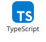</picture>
<picture><source media="(prefers-color-scheme: dark)" srcset="assets/tools/rust-dark.svg">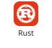</picture>
<picture><source media="(prefers-color-scheme: dark)" srcset="assets/tools/java-dark.svg">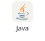</picture>
<picture><source media="(prefers-color-scheme: dark)" srcset="assets/tools/c-dark.svg"></picture>
<picture><source media="(prefers-color-scheme: dark)" srcset="assets/tools/js-dark.svg">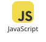</picture>
<picture><source media="(prefers-color-scheme: dark)" srcset="assets/tools/dart-dark.svg">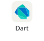</picture>
<picture><source media="(prefers-color-scheme: dark)" srcset="assets/tools/bash-dark.svg"></picture>
<picture><source media="(prefers-color-scheme: dark)" srcset="assets/tools/powershell-dark.svg"></picture>
<picture><source media="(prefers-color-scheme: dark)" srcset="assets/tools/r-dark.svg"></picture>
<picture><source media="(prefers-color-scheme: dark)" srcset="assets/tools/matlab-dark.svg"></picture>
<picture><source media="(prefers-color-scheme: dark)" srcset="assets/tools/haskell-dark.svg">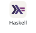</picture>
<picture><source media="(prefers-color-scheme: dark)" srcset="assets/tools/swift-dark.svg"></picture>
<picture><source media="(prefers-color-scheme: dark)" srcset="assets/tools/solidity-dark.svg">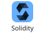</picture>
<picture><source media="(prefers-color-scheme: dark)" srcset="assets/tools/html-dark.svg"></picture>
<picture><source media="(prefers-color-scheme: dark)" srcset="assets/tools/css-dark.svg"></picture>

<b>MACHINE LEARNING &amp; DATA SCIENCE</b>

<picture><source media="(prefers-color-scheme: dark)" srcset="assets/tools/pytorch-dark.svg"></picture>
<picture><source media="(prefers-color-scheme: dark)" srcset="assets/tools/tensorflow-dark.svg"></picture>
<picture><source media="(prefers-color-scheme: dark)" srcset="assets/tools/sklearn-dark.svg"></picture>
<picture><source media="(prefers-color-scheme: dark)" srcset="assets/tools/huggingface-dark.svg"></picture>
<picture><source media="(prefers-color-scheme: dark)" srcset="assets/tools/pandas-dark.svg"></picture>
<picture><source media="(prefers-color-scheme: dark)" srcset="assets/tools/numpy-dark.svg"></picture>
<picture><source media="(prefers-color-scheme: dark)" srcset="assets/tools/opencv-dark.svg">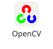</picture>
<picture><source media="(prefers-color-scheme: dark)" srcset="assets/tools/keras-dark.svg"></picture>
<picture><source media="(prefers-color-scheme: dark)" srcset="assets/tools/pyg-dark.svg"></picture>
<picture><source media="(prefers-color-scheme: dark)" srcset="assets/tools/scipy-dark.svg">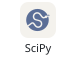</picture>
<picture><source media="(prefers-color-scheme: dark)" srcset="assets/tools/plotly-dark.svg">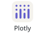</picture>
<picture><source media="(prefers-color-scheme: dark)" srcset="assets/tools/jupyter-dark.svg"></picture>
<picture><source media="(prefers-color-scheme: dark)" srcset="assets/tools/anaconda-dark.svg"></picture>
<picture><source media="(prefers-color-scheme: dark)" srcset="assets/tools/nvidia-dark.svg"></picture>
<picture><source media="(prefers-color-scheme: dark)" srcset="assets/tools/mlflow-dark.svg">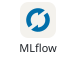</picture>
<picture><source media="(prefers-color-scheme: dark)" srcset="assets/tools/weightsandbiases-dark.svg"></picture>
<picture><source media="(prefers-color-scheme: dark)" srcset="assets/tools/optuna-dark.svg"></picture>

<b>LANGUAGE MODELS &amp; AGENTS</b>

<picture><source media="(prefers-color-scheme: dark)" srcset="assets/tools/claude-dark.svg"></picture>
<picture><source media="(prefers-color-scheme: dark)" srcset="assets/tools/googlegemini-dark.svg"></picture>
<picture><source media="(prefers-color-scheme: dark)" srcset="assets/tools/ollama-dark.svg"></picture>
<picture><source media="(prefers-color-scheme: dark)" srcset="assets/tools/langchain-dark.svg"></picture>
<picture><source media="(prefers-color-scheme: dark)" srcset="assets/tools/langgraph-dark.svg">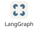</picture>
<picture><source media="(prefers-color-scheme: dark)" srcset="assets/tools/modelcontextprotocol-dark.svg"></picture>
<picture><source media="(prefers-color-scheme: dark)" srcset="assets/tools/vllm-dark.svg">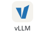</picture>
<picture><source media="(prefers-color-scheme: dark)" srcset="assets/tools/qwen-dark.svg"></picture>
<picture><source media="(prefers-color-scheme: dark)" srcset="assets/tools/crewai-dark.svg"></picture>
<picture><source media="(prefers-color-scheme: dark)" srcset="assets/tools/pydantic-dark.svg"></picture>
<picture><source media="(prefers-color-scheme: dark)" srcset="assets/tools/gradio-dark.svg">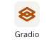</picture>
<picture><source media="(prefers-color-scheme: dark)" srcset="assets/tools/qdrant-dark.svg"></picture>
<picture><source media="(prefers-color-scheme: dark)" srcset="assets/tools/opentelemetry-dark.svg"></picture>
<picture><source media="(prefers-color-scheme: dark)" srcset="assets/tools/modal-dark.svg"></picture>

<b>DATA ENGINEERING</b>

<picture><source media="(prefers-color-scheme: dark)" srcset="assets/tools/kafka-dark.svg"></picture>
<picture><source media="(prefers-color-scheme: dark)" srcset="assets/tools/apachespark-dark.svg"></picture>
<picture><source media="(prefers-color-scheme: dark)" srcset="assets/tools/apacheairflow-dark.svg"></picture>
<picture><source media="(prefers-color-scheme: dark)" srcset="assets/tools/snowflake-dark.svg"></picture>
<picture><source media="(prefers-color-scheme: dark)" srcset="assets/tools/googlebigquery-dark.svg"></picture>
<picture><source media="(prefers-color-scheme: dark)" srcset="assets/tools/apachehadoop-dark.svg">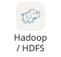</picture>
<picture><source media="(prefers-color-scheme: dark)" srcset="assets/tools/apachehive-dark.svg"></picture>
<picture><source media="(prefers-color-scheme: dark)" srcset="assets/tools/apacheparquet-dark.svg">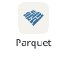</picture>
<picture><source media="(prefers-color-scheme: dark)" srcset="assets/tools/apachearrow-dark.svg"></picture>

<b>DATABASES &amp; SEARCH</b>

<picture><source media="(prefers-color-scheme: dark)" srcset="assets/tools/postgres-dark.svg"></picture>
<picture><source media="(prefers-color-scheme: dark)" srcset="assets/tools/supabase-dark.svg">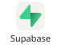</picture>
<picture><source media="(prefers-color-scheme: dark)" srcset="assets/tools/mysql-dark.svg"></picture>
<picture><source media="(prefers-color-scheme: dark)" srcset="assets/tools/mongodb-dark.svg"></picture>
<picture><source media="(prefers-color-scheme: dark)" srcset="assets/tools/redis-dark.svg"></picture>
<picture><source media="(prefers-color-scheme: dark)" srcset="assets/tools/elasticsearch-dark.svg"></picture>
<picture><source media="(prefers-color-scheme: dark)" srcset="assets/tools/cassandra-dark.svg">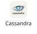</picture>
<picture><source media="(prefers-color-scheme: dark)" srcset="assets/tools/sqlite-dark.svg"></picture>
<picture><source media="(prefers-color-scheme: dark)" srcset="assets/tools/neo4j-dark.svg"></picture>
<picture><source media="(prefers-color-scheme: dark)" srcset="assets/tools/dynamodb-dark.svg">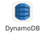</picture>
<picture><source media="(prefers-color-scheme: dark)" srcset="assets/tools/firebase-dark.svg"></picture>

<b>BACKEND &amp; APIS</b>

<picture><source media="(prefers-color-scheme: dark)" srcset="assets/tools/fastapi-dark.svg">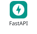</picture>
<picture><source media="(prefers-color-scheme: dark)" srcset="assets/tools/flask-dark.svg">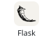</picture>
<picture><source media="(prefers-color-scheme: dark)" srcset="assets/tools/django-dark.svg"></picture>
<picture><source media="(prefers-color-scheme: dark)" srcset="assets/tools/graphql-dark.svg"></picture>
<picture><source media="(prefers-color-scheme: dark)" srcset="assets/tools/nodejs-dark.svg">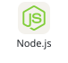</picture>
<picture><source media="(prefers-color-scheme: dark)" srcset="assets/tools/pytest-dark.svg"></picture>
<picture><source media="(prefers-color-scheme: dark)" srcset="assets/tools/sqlalchemy-dark.svg">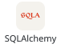</picture>
<picture><source media="(prefers-color-scheme: dark)" srcset="assets/tools/gunicorn-dark.svg"></picture>
<picture><source media="(prefers-color-scheme: dark)" srcset="assets/tools/openapiinitiative-dark.svg"></picture>
<picture><source media="(prefers-color-scheme: dark)" srcset="assets/tools/postman-dark.svg"></picture>
<picture><source media="(prefers-color-scheme: dark)" srcset="assets/tools/gradle-dark.svg"></picture>

<b>WEB, MOBILE &amp; 3D</b>

<picture><source media="(prefers-color-scheme: dark)" srcset="assets/tools/react-dark.svg"></picture>
<picture><source media="(prefers-color-scheme: dark)" srcset="assets/tools/nextjs-dark.svg">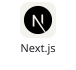</picture>
<picture><source media="(prefers-color-scheme: dark)" srcset="assets/tools/threejs-dark.svg">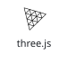</picture>
<picture><source media="(prefers-color-scheme: dark)" srcset="assets/tools/flutter-dark.svg">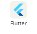</picture>
<picture><source media="(prefers-color-scheme: dark)" srcset="assets/tools/tailwind-dark.svg">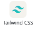</picture>
<picture><source media="(prefers-color-scheme: dark)" srcset="assets/tools/vite-dark.svg">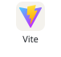</picture>
<picture><source media="(prefers-color-scheme: dark)" srcset="assets/tools/greensock-dark.svg"></picture>
<picture><source media="(prefers-color-scheme: dark)" srcset="assets/tools/webrtc-dark.svg"></picture>

<b>CLOUD &amp; DEVOPS</b>

<picture><source media="(prefers-color-scheme: dark)" srcset="assets/tools/docker-dark.svg"></picture>
<picture><source media="(prefers-color-scheme: dark)" srcset="assets/tools/kubernetes-dark.svg">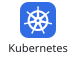</picture>
<picture><source media="(prefers-color-scheme: dark)" srcset="assets/tools/aws-dark.svg"></picture>
<picture><source media="(prefers-color-scheme: dark)" srcset="assets/tools/gcp-dark.svg"></picture>
<picture><source media="(prefers-color-scheme: dark)" srcset="assets/tools/azure-dark.svg"></picture>
<picture><source media="(prefers-color-scheme: dark)" srcset="assets/tools/githubactions-dark.svg"></picture>
<picture><source media="(prefers-color-scheme: dark)" srcset="assets/tools/git-dark.svg"></picture>
<picture><source media="(prefers-color-scheme: dark)" srcset="assets/tools/github-dark.svg"></picture>
<picture><source media="(prefers-color-scheme: dark)" srcset="assets/tools/gitlab-dark.svg">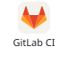</picture>
<picture><source media="(prefers-color-scheme: dark)" srcset="assets/tools/vercel-dark.svg"></picture>
<picture><source media="(prefers-color-scheme: dark)" srcset="assets/tools/linux-dark.svg">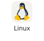</picture>
<picture><source media="(prefers-color-scheme: dark)" srcset="assets/tools/githubpages-dark.svg"></picture>
<picture><source media="(prefers-color-scheme: dark)" srcset="assets/tools/k6-dark.svg">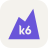</picture>
<picture><source media="(prefers-color-scheme: dark)" srcset="assets/tools/precommit-dark.svg"></picture>
<picture><source media="(prefers-color-scheme: dark)" srcset="assets/tools/uv-dark.svg"></picture>
<picture><source media="(prefers-color-scheme: dark)" srcset="assets/tools/raspberrypi-dark.svg">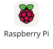</picture>

<b>AUTOMATION &amp; SCRAPING</b>

<picture><source media="(prefers-color-scheme: dark)" srcset="assets/tools/selenium-dark.svg"></picture>
<picture><source media="(prefers-color-scheme: dark)" srcset="assets/tools/scrapy-dark.svg"></picture>
<picture><source media="(prefers-color-scheme: dark)" srcset="assets/tools/ffmpeg-dark.svg">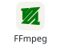</picture>
<picture><source media="(prefers-color-scheme: dark)" srcset="assets/tools/openstreetmap-dark.svg"></picture>

<b>DESIGN &amp; DOCS</b>

<picture><source media="(prefers-color-scheme: dark)" srcset="assets/tools/figma-dark.svg"></picture>
<picture><source media="(prefers-color-scheme: dark)" srcset="assets/tools/notion-dark.svg"></picture>

Also used, without a logo above: OpenAI API · LlamaIndex · gRPC · Protocol Buffers · XGBoost · LightGBM · PEFT/LoRA · TRL · FAISS · ChromaDB · pgvector · DeepEval · Playwright · dbt · Great Expectations · Power BI · Matplotlib · seaborn · Altair · statsmodels · Groq API · Hugging Face Accelerate · React Three Fiber · Framer Motion · Detectron2 · Riverpod · Canva

<!-- toolbox:end -->

<picture>
  <source media="(prefers-color-scheme: dark)" srcset="https://raw.githubusercontent.com/muhammad-musa-ml/muhammad-musa-ml/output/github-snake-dark.svg">
  
</picture>

The snake gets redrawn every night from my contribution graph.

